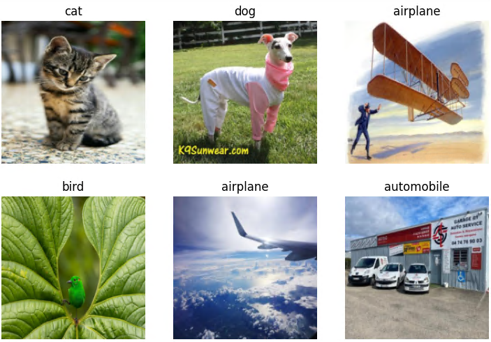

Now that we understand how to build a model, time to improve on the previous exmaple by including more criteria. Rather then just a bird and forest, let's compare airplanes, automobiles, cats, dogs and birds. Two different categories of objects, transportation and pets, and within these two categories are unique classes. Rather than distinguish between two vastly different classes, it now has two differentiate similar features betweeen living creatuers, as well as the similarites between planes and cars. 

# Creating test data
To generate images, DuckDuckGo was incorparated. It was able to succesffuly gather roughly 200 unique images of each class. 

The image above showing clearly that all classes were sucessfully found online. 

After constructing the model similar to the previous post, it was time to test it on a new data set. A dataloader was initialised in the same way as the previous post. Due to the extra classes and subsequent extra test data, the training took longer, taking 2 and a half minutes. However, the important detail was the low error rate that after fine tuning.

# Accuracy
The model is ready for testing. An important concept in deep learning is **over fitting**. With a poor data set and too much fine tuning, a data set may be trained to only work on the data set provided for testing and validation. If this happens, while it may appear to work on the inital test data, any new data may not be useable. To ensure the usefullness of the newly made model, new data needs to be tested. More specifically, pre validated data neads to be tested agaisnt. Using **DuckDuckGo** to scrape data from the web may return incorrect data. A pre-made data set that has already been confirmed to contain the desired object classes is required. 

**Kaggle** is a website with free to use datasets. Public data sets on all classes were found however some sets were tens of thousands in size. For simplicity, only 50 images per set were used. Using these images, the following was obtained:

| Object Class | Images Processed | Correct Predictions | Accuracy (%) | 
| ------------- | ------------- | ------------- | ------------- |
| Cat | 29 | 29 | 100 |
| Dog | 50 | 50 | 100 |
| Automobile | 50 | 50 | 100 |
| Car | 50 | 50 | 100 |
| Bird | 19 | 16 | 84.21 |
| Total | 198 | 195 | 98.48 |

The above table showed a very successful model. Some images were failed to be converted to data and were subsequently not included in the testing. Additionally the bird class was slightly inaccurate. However across 200 images, a **98.48%** accuracy was achieved, with perfect detection on cat, dog, car and plane classes on new data. These tests conclusively show a well trained model, however there may be additional tools that can prove this, even without new data.

